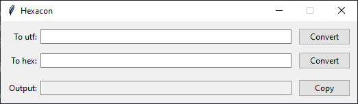

<h1 align="center">
  Hexacon
</h1>

<p align="center">
    Hexacon is a GUI application for converting hexadecimal strings to utf-8 and vice versa.
</p>

<p align="center">
  <a style="text-decoration:none" href="https://www.python.org/">
    
  </a>
</p>

<div align="center">



</div>

# Features

  - Convert any Unicode symbol.
  - Convert hexadecimal strings with or without `\x`.
  - Click `Copy`, to copy converted text to clipboard.

# Examples

### utf 🠦 hex
```python
  "This is a string" 🠦 "\x54\x68\x69\x73\x20\x69\x73\x20\x61\x20\x73\x74\x72\x69\x6e\x67"
```

### hex 🠦 utf
```python
"54686973206973206120737472696e67" 🠦 "This is a string"
```

## License:

This software is available under the following licenses:

  * **MIT**
